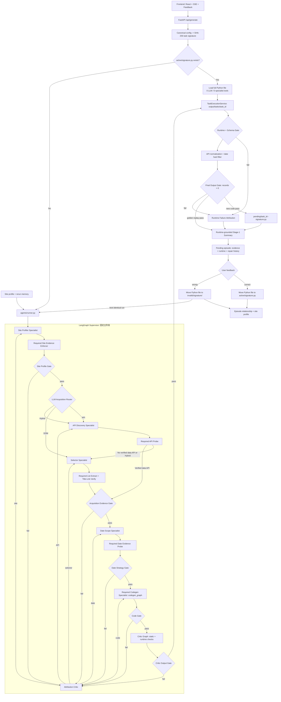

# SpiderGenAI-v2  基于 LangGraph 多智能体的自动网站分析与爬虫脚本生成系统

> 当前主线：**参数签名黄金爬虫复用** + **LangGraph 证据驱动专家流水线** + **阶段 Gate** + **失败归因回退** + **任务隔离运行** + **运行后记忆闭环**。
> Current mainline: **signature-keyed golden crawler replay**, **evidence-driven LangGraph specialists**, **stage gates**, **failure attribution and rollback**, **task-isolated execution**, and **runtime-grounded memory**.
### 注：该agent是用于生成爬虫代码，便于日后代码入库跑批，是生成爬虫代码的agent，不建议您当成直接帮您爬东西的agent的使用。

## 目录 (Table of Contents)

- [v2 重要改动 / What's new in v2](#whats-new)
- [简介 / Overview](#overview)
- [功能 / Key features](#features)
- [快速开始 / Quickstart](#quickstart)
  - [后端依赖安装 / Backend install](#backend-install)
  - [Docker 沙箱环境 / Docker Sandbox Setup](#docker-sandbox)
  - [配置 config.yaml / Configure config.yaml](#configure-config)
  - [启动/部署 Chrome + CDP / Chrome + CDP](#chrome-cdp)
  - [启动后端 / Run backend](#run-backend)
  - [启动前端 / Run frontend](#run-frontend)
- [前端界面使用说明 / UI Guide](#ui-guide)
- [输出位置 / Outputs](#outputs)
- [v2 架构 / v2 Architecture](#v2-architecture)
  - [LangGraph 多智能体总览](#multi-agent-overview)
  - [黄金爬虫生命周期](#golden-crawler-lifecycle)
  - [Prompt 资产化](#prompt-assets)
  - [会话记忆 + 持久记忆](#memory)
  - [用户反馈闭环](#feedback-loop)
  - [总结复盘 Agent](#summary-agent)
- [目录结构与核心文件说明 / Structure & Key files](#structure-files)
- [常见问题 / Troubleshooting](#troubleshooting)

---

## 🦹🏻Authors作者: Liu， Jack Xingchen — Deloitte Shanghai

<a id="whats-new"></a>
## v2 重要改动 (What's new in v2)

| 改动 | 精简描述 | 收益 / 好处 |
|------|---------|-------------|
| **1. 架构升级：证据驱动 Specialist Pipeline** | `Supervisor` 固定主阶段；Site Profiler / API Discovery / Selector / Date Scope 使用 ReAct 动态探测，每个探测专家后接确定性的 Evidence Enforcer，Codegen 到达阶段后必定执行独立 `codegen_graph`。采集路线由 LLM Router 在 API、DOM、Hybrid 之间动态选择。 | 同一任务既保留 LLM 对未知网站的适应性，又保证页面恢复、API 探测、Selector 提取、日期探测和代码生成等必做动作不会被模型用一段文本跳过。 |
| **2. Prompt 资产化** | 所有长 prompt 从代码里抽出，按 `planner/`、`codegen/`、`critic/`、`browser/`、`summarize/`、`errors/` 分目录落盘为 `.md`，通过 `PromptLoader`（带 `lru_cache` + debug dump + 热重载）按需加载与变量渲染。 | Prompt 迭代不再需要改 Python 代码、写 diff 也更清晰；支持 A/B 切换、`PYGEN_DEBUG_DUMP_PROMPT` 一键产出渲染后版本供回归；非技术同事也能直接维护提示词。 |
| **3. 证据、Gate 与可归因回退** | 每个阶段输出 `StageEvidence`：候选 ID、断言、置信度、artifact、风险和淘汰原因；确定性 Gate 决定能否前进。Critic 失败后先按失败类型归因，未知类型才交给 LLM Attribution Critic，并回退到责任专家。 | 不再相信 Agent 自报的 `success=true`；最终零数据可以追溯到 API、selector、日期或代码候选，并保存每次修复历史，避免从头盲目重跑。 |
| **4. 用户反馈功能** | 任务结束后前端弹出 `TaskFeedbackModal`，用户打标签 (correct/wrong) + 填写自然语言建议。后端 `POST /api/tasks/{task_id}/feedback` 把反馈注入 `commit_episode`，并可一键"提交并重新运行"。 | 人在回路 (Human-in-the-loop)：用户的业务语言描述被 LLM 翻译成技术根因并写入记忆；重跑时这段诊断作为最高优先级上下文注入专家图，错过一次的问题不会再重复试。 |
| **5. 运行后总结与持久记忆** | Stage-1 不再位于 Agent 图末尾，而是在任务隔离运行、JSON schema、日期过滤和最终非空 Gate 之后执行；成功和失败都会写入带 runtime report、阶段证据和修复历史的 pending episode。Stage-2 仍由用户反馈触发 `commit_episode`。 | 记忆学习的是实际爬取结果，而不是生成代码后的乐观判断；“工具把错判成对”会通过最终结果暴露，并成为下次同站任务的候选黑名单或经验。 |
| **6. 人工确认的黄金爬虫复用** | 对影响爬虫行为的配置计算 SHA-256 参数签名。首次生成并通过 Runtime/Final Output Gate 后，完整 `.py` 进入 `pending`；用户确认后移动到 `active`。相同签名再次运行时直接加载该文件并跳过 LLM、记忆注入和专家图。 | 已成功且参数完全一致的任务不再重复生成代码，消除模型随机性并显著降低延迟与 token 成本；脚本失效时移入 `invalid`，下一次自动恢复完整 Agent 流程。 |
| **7. 新闻正文与附件双通道** | 新闻详情页的 `content` 与 `attachments[]` 独立采集。附件发现覆盖下载按钮、正文链接、`object/embed/iframe`、`data-*`、`onclick` 和直接文件 URL；后端统一归一化、去重并按需下载。 | 同一篇新闻可同时展示正文和 PDF/文档，不再让文件容器参与正文候选竞争；附件下载失败时仍保留远程链接，不影响正文和文章记录通过最终 Gate。 |

---

<a id="overview"></a>
## 简介 (Overview)

这是一个**基于 LangGraph 多智能体编排的"智能分析网站 → 生成爬虫脚本 → 执行 → 复盘 → 前端可视化"**完整工程：

- **后端**：`pygen/api.py`（FastAPI）先计算任务签名并查询 `active` 黄金爬虫；命中时直接执行完整 `.py`，未命中才调用 `pygen/agents/runner.py` 进入 **LangGraph 专家图**，随后统一通过任务隔离运行与最终输出 Gate
- **前端**：`frontend/`（Vite + React + TS）负责表单配置、展示日志与结果，并在任务结束时弹出**反馈 Modal** 收集用户评价
- **浏览器自动化**：通过 **Chrome DevTools Protocol (CDP)** 连接到 Chrome，并用 Playwright 做页面交互与网络请求捕获
- **黄金资产层**：`pygen/output/golden_crawlers/` 只保存完整 Python 文件，目录表达 `pending/active/invalid` 状态；无 manifest、无代码 JSON 副本
- **记忆层**：`pygen/output/memory/` 落盘 episodes（情景）+ site profile（网站画像），只记录黄金脚本关联关系与诊断经验，不承担代码复用

This repo provides an end-to-end **LangGraph multi-agent** workflow:

- **Backend**: `pygen/api.py` drives a LangGraph specialist state machine, then executes the crawler in a task-owned runtime directory before committing memory
- **Frontend**: `frontend/` (Vite + React + TS) provides UI + a post-run feedback Modal for human-in-the-loop supervision
- **Browser automation**: Playwright over CDP
- **Memory**: JSONL episodes + per-site profiles persisted under `pygen/output/memory/`

---

<a id="features"></a>
## 功能 (Key features)

- **LangGraph 专家状态机**：固定主阶段 + 动态 API/DOM/Hybrid 分支 + 按失败类型定向回退
- **Prompt 资产化**：静态 prompt 全部 `.md` 化、目录分层、支持热重载/A-B 切换/变量校验
- **受限动态工具生态**：原有 20+ 工具继续维护，但通过专家 allowlist 分配；每个专家内部用 ReAct 动态选择自己的工具
- **Critic 质量关卡**：独立子图，3 轮"诊断 → 修复 → 重新验证"循环
- **任务隔离运行**：每个任务写入 `pygen/output/tasks/<task_id>/`，Docker 优先、本地回退，显式生成 `result_manifest.json`
- **会话记忆**：`AgentState` 共享消息、工具日志、候选证据、Gate 报告、归因决定和修复历史
- **持久记忆**：episodes.jsonl（情景）+ site/<domain>.json（画像），带时间衰减 / 黑名单 / stable 晋升
- **用户反馈闭环**：前端 Feedback Modal → commit_episode → LLM 蒸馏 lessons → 下次同站自动注入
- **运行后总结 Agent**：真实运行与最终非空 Gate 后运行 auto_findings，用户反馈再驱动 LLM 蒸馏
- **确定性黄金复用**：相同参数签名命中 `active` 后 0 次 LLM、0 次专家工具调用，仍执行 Runtime/Final Output Gate 和人工审核
- **多板块爬取**：支持手动选择目录树（多板块）与自动探测板块
- **结果可视化 + 批量任务**：实时日志、下载脚本、报告/新闻列表、批量队列与 SSE 状态
- **新闻正文 + 附件展示**：正文与附件分开呈现；PDF/文档既可来自按钮，也可来自正文链接或嵌入标签，本地下载失败时回退到远程链接

---

<a id="quickstart"></a>
## 快速开始 (Quickstart)

### 环境要求 (Prerequisites)

- **Windows 10/11 / macOS**（本文以 Windows 为主，同时补充 macOS 指令）
- **Python**：建议 3.10+
- **Node.js**：建议 18+ / 20+
- **Google Chrome**：已安装（后端会自动寻找 Chrome 并启动 CDP）
- **Docker Desktop**：Agent 生成的代码会在 Docker 容器中执行验证（Critic 质量关卡），**强烈推荐安装**。未安装时系统回退到本地子进程执行（安全性和隔离性较低）。详见下方 [Docker 沙箱环境](#docker-sandbox) 章节

---

<a id="backend-install"></a>
### 1) 后端依赖安装 (Backend install)

在项目根目录执行：

```bash
python -m venv .venv
.\.venv\Scripts\activate
pip install -r pygen\requirements.txt
python -m playwright install chromium
```

macOS / Linux（bash / zsh）对应指令：

```bash
python3 -m venv .venv
source .venv/bin/activate
python -m pip install -r pygen/requirements.txt
python -m playwright install chromium
```

> 说明：即便使用 CDP 连接本机 Chrome，也需要安装 Playwright 运行时依赖。`pygen/requirements.txt` 已包含 `langgraph` / `langchain-core` 等 v2 依赖。

---

<a id="docker-sandbox"></a>
### 2) Docker 沙箱环境配置 (Docker Sandbox Setup)

Agent 生成的爬虫代码会在 **Docker 容器**中先行执行验证（Critic 质量关卡 → 沙箱运行 → 检查输出），因此需要本机安装 Docker 环境。若未检测到 Docker，系统会自动回退到本地子进程执行（`local` 模式），隔离性和安全性较低。

#### 2.1) 安装 Docker Desktop

##### Windows

1. 下载 Docker Desktop：<https://www.docker.com/products/docker-desktop/>
2. 双击安装包运行，安装向导中**勾选 "Use WSL 2 instead of Hyper-V"**（推荐）
3. 安装完成后**重启电脑**
4. 启动 Docker Desktop，等待左下角引擎状态变为绿色 **Running**
5. 打开 PowerShell 验证：

```powershell
docker --version
docker info
```

> **Windows 前置要求**
> - 需要 **WSL 2**（Windows Subsystem for Linux 2）。若系统提示未安装，以管理员身份打开 PowerShell 执行：
>   ```powershell
>   wsl --install
>   ```
>   然后重启电脑。
> - BIOS 中须启用虚拟化（Intel VT-x / AMD-V）。大部分笔记本出厂已启用，如遇报错请进 BIOS 手动开启。
> - 如遇 Windows 防火墙提示，请允许 Docker Desktop 通过。

##### macOS

1. 下载 Docker Desktop（根据芯片选择对应版本）：
   - **Apple Silicon (M1/M2/M3/M4)**：<https://desktop.docker.com/mac/main/arm64/Docker.dmg>
   - **Intel**：<https://desktop.docker.com/mac/main/amd64/Docker.dmg>
2. 打开 `.dmg`，将 Docker 拖拽到 Applications 文件夹
3. 启动 Docker Desktop，首次打开时 macOS 会弹出安全性提示 → 前往"系统设置 → 隐私与安全性"允许即可
4. 等待菜单栏 Docker 鲸鱼图标稳定（不再转动），打开终端验证：

```bash
docker --version
docker info
```

---

#### 2.2) 构建沙箱镜像（推荐，预装所有依赖）

项目根目录已包含 `Dockerfile`，会在构建时把 `pygen/requirements.txt` 里的**所有 Python 库**安装进镜像。**Windows 与 macOS 命令完全相同**，在项目根目录打开终端执行：

```bash
docker build -t pygen-sandbox .
```

> 首次构建需要下载基础镜像（约 2 GB）+ 安装依赖，预计 3-10 分钟（取决于网络）。后续重建利用缓存会很快。

##### 构建完成后：配置 `config.yaml`

在 `config.yaml` 中添加 `sandbox` 段，指向你构建的镜像：

```yaml
sandbox:
  enabled: true
  backend: docker            # 使用 Docker 沙箱
  docker_image: "pygen-sandbox"   # 刚才 docker build -t 后面的名字
  docker_auto_pull: false    # 本地已构建，无需自动拉取
```

##### requirements.txt 更新后必须重新构建

每次修改 `pygen/requirements.txt`（添加/删除/升级库）后，**必须重新执行**：

```bash
docker build -t pygen-sandbox .
```

否则沙箱容器中会缺少新增的库，导致 Agent 验证代码时报 `ModuleNotFoundError`。

---

#### 2.3) 使用默认基础镜像（快速上手，不推荐）

如果不想手动构建，系统首次运行时会**自动拉取**微软官方 Playwright 镜像：

```bash
docker pull mcr.microsoft.com/playwright/python:v1.41.0-jammy
```

> **注意**：基础镜像**不包含** `requirements.txt` 中的额外依赖（`requests`、`beautifulsoup4`、`httpx` 等）。Agent 会在运行时通过 `install_python_packages` 工具按需安装，但**每次新建容器都需要重新安装**，首次验证耗时更长。推荐使用 2.2 的构建方式。

---

#### 2.4) Docker Desktop 资源配置建议

打开 Docker Desktop → **Settings → Resources**：

| 资源 | 推荐最低值 | 说明 |
|------|-----------|------|
| **CPU** | ≥ 2 核 | 沙箱执行生成脚本 + 浏览器渲染 |
| **Memory** | ≥ 4 GB | Playwright Chromium 内存占用较高 |
| **Disk** | ≥ 10 GB | 基础镜像约 2-3 GB + 构建缓存 |

> **Windows WSL 2 用户**：资源上限由 WSL 控制。如需调整，编辑 `%USERPROFILE%\.wslconfig`：
>
> ```ini
> [wsl2]
> memory=8GB
> processors=4
> ```
>
> 保存后在 PowerShell 执行 `wsl --shutdown` 使配置生效。

---

#### 2.5) 验证 Docker 沙箱环境

```bash
docker run --rm hello-world
docker run --rm pygen-sandbox python -c "import requests; import bs4; import httpx; import lxml; import pydantic; print('All dependencies OK')"
docker run --rm pygen-sandbox python -c "from playwright.sync_api import sync_playwright; print('Playwright OK')"
```

如果以上命令全部输出正常，Docker 沙箱环境即就绪。

---

#### 2.6) 重要注意事项

1. **Docker Desktop 必须保持运行**：后端启动任务时会通过 Docker CLI 创建沙箱容器。如果 Docker Desktop 未启动，系统自动回退到 `local` 模式
2. **首次拉取/构建较慢**：Playwright 基础镜像约 2 GB，请确保网络通畅；后续构建利用缓存会很快
3. **镜像与 requirements.txt 同步**：每次修改 `pygen/requirements.txt` 后，务必重新 `docker build -t pygen-sandbox .`，否则沙箱中会缺少新增的库
4. **磁盘清理**：长时间使用后可运行 `docker system prune -f` 清理悬空镜像和停止的容器
5. **多任务并发**：每个任务会启动独立的沙箱容器（容器名格式 `pygen-exec-<session_id>`），任务结束后自动销毁（`--rm`）

---

<a id="configure-config"></a>
### 3) 配置 `config.yaml` (Configure `config.yaml`)

本项目会优先读取：

1. `pygen/config.yaml`（若存在）
2. 项目根目录 `config.yaml`

建议做法：

- 复制模板：`config_copy.yaml` → `config.yaml`
- 填入你的 **LLM API Key** 与 **CDP 配置**

关键配置示例（节选，v2 新增 `memory:` / `page_cache:` 段）：

```yaml
llm:
  active: gemini
  gemini:
    api_key: "YOUR_API_KEY"
    model: "gemini-3-pro-preview"
    base_url: "https://generativelanguage.googleapis.com/v1beta/"

cdp:
  debug_port: 9222
  auto_select_port: true
  user_data_dir: "D:/llm_mcp_genpy_runtime/chrome-profile"
  timeout: 60

sandbox:
  enabled: true
  backend: auto               # docker / local / auto
  docker_image: "pygen-sandbox"
  docker_auto_pull: false
  docker_mount_workdir: true
  docker_disable_network: false

# v2 新增：持久化记忆 (episodes + site profile)
memory:
  enabled: true
  root: pygen/output/memory
  episodes:
    max_keep: 1000
    pending_gc_days: 30
  site_profile:
    enabled: true
    inject_into_planner: true
    confidence_decay_per_30d: 0.1
    blacklist_min_losses: 1
  summary_agent:
    use_llm: true
    model_strategy: task_model   # 复盘用 LLM：task_model / small_model / draft_alias
    enable_auto_findings: true
  rerun:
    feedback_replay_priority: highest
    feedback_replay_hops: 3
    feedback_replay_domain_fallback: true
```

> macOS 提示：`cdp.user_data_dir` 建议使用类似 `"/Users/<you>/llm_mcp_genpy_runtime/chrome-profile"` 或 `"$HOME/llm_mcp_genpy_runtime/chrome-profile"`。
> 更多 memory 配置项（黑名单/隔离/漂移检测/回放跳数等）见 `config.yaml` 内的详细注释。

---

<a id="chrome-cdp"></a>
### 4) 启动/部署 Chrome + CDP (Chrome + CDP)

本项目默认会在后端启动任务时**自动启动 Chrome（CDP 模式）**，你通常不需要手工启动。

#### 方式 A：自动启动（推荐）

直接启动后端即可（见下一节）。后端会：

- 查找 Chrome 可执行文件
- 以 `--remote-debugging-port` 启动 Chrome
- 使用 `cdp.user_data_dir` 作为持久化 Profile

#### 方式 B：手动启动（适合排障/复用你的 Chrome）

如果你想手工启动 Chrome 并让后端复用它（端口默认 `9222`），可以在 PowerShell 里执行：

```powershell
"C:\Program Files\Google\Chrome\Application\chrome.exe" `
  --remote-debugging-port=9222 `
  --user-data-dir="D:\llm_mcp_genpy_runtime\chrome-profile" `
  --no-first-run --no-default-browser-check
```

macOS 下可执行（注意应用路径中包含空格）：

```bash
"/Applications/Google Chrome.app/Contents/MacOS/Google Chrome" \
  --remote-debugging-port=9222 \
  --user-data-dir="$HOME/llm_mcp_genpy_runtime/chrome-profile" \
  --no-first-run --no-default-browser-check
```

#### 登录态说明 (Login persistence)

如果目标网站需要登录：

- 先用上述 Profile 启动 Chrome
- 在 Chrome 中手动登录一次
- 后续任务会复用该 Profile 的 Cookies/LocalStorage

---

<a id="run-backend"></a>
### 5) 启动后端 (Run backend)

在项目根目录执行：

```bash
# Windows
python pygen\api.py

# macOS / Linux
python pygen/api.py
```

- API 文档：`http://localhost:8000/docs`
- 前端默认请求后端：`http://localhost:8000`（见 `frontend/types.ts`）

---

<a id="run-frontend"></a>
### 6) 启动前端 (Run frontend)

新开一个终端：

```bash
cd frontend
npm install
npm run dev
```

然后访问 Vite 提示的本地地址（通常为 `http://localhost:5173`）。

---

<a id="ui-guide"></a>
## 前端界面使用说明 (UI Guide)

### 基本流程 (Basic flow)

> **批量爬取 (Batch Mode)**：点击首页右上角"批量报告爬取"按钮，可进入批量任务配置与监控界面。

1. 选择**运行模式**（企业报告下载 / 新闻报告下载 / 新闻舆情爬取）
2. 填写 URL、日期范围、是否下载文件等
3. 点击执行后先匹配黄金爬虫；命中则直接执行，未命中才由 LangGraph 多智能体完成网站分析 → 策略选择 → 代码生成 → 质量验证 → 执行 → 自我复盘
4. 在执行页查看日志与结果，必要时下载生成脚本
5. 任务结束后**弹出反馈 Modal**：打 correct/wrong 标签 + 填写自然语言建议，可选择"提交并重新运行"让 Agent 按你的反馈二次尝试

### 额外需求与附件 (Extra requirements & attachments)

- "额外需求"支持输入文字，并可附加图片/文件
- 额外需求会作为 Agent 的最高优先级指令，指导其探测方向

### 结果展示 (Results)

- 企业/新闻报告：展示报告列表；多板块模式下会额外显示"来源板块"
- 新闻舆情：展示文章列表与详情；多板块模式下同样显示"来源板块"

### 界面演示 (UI presentation)

> 提示：以下为 `pic/` 目录内的 GIF 演示图，便于快速了解前端交互流程。
> Tip: The following GIFs are stored under `pic/` for a quick UI walkthrough.

#### 1) 首页 (Homepage)


- **说明**：填写 URL、日期范围、运行模式等基础配置。
- **Note**: Fill in URL, date range, run mode, etc.

#### 2) 自动识别网页目录树并选择 (Tree selection)


- **说明**：多板块爬取（手动）时，用户可以选择手动选取需要爬取的板块。
- **Note**: Select category paths when using manual multi-category crawling.

#### 3) 企业报告下载 - 执行监控 (Enterprise report - execution)


- **说明**：查看任务日志、进度与报告结果列表；可下载生成脚本/查看文件。
- **Note**: Monitor logs/progress and inspect report results; download the generated script/files.

#### 4) 新闻舆情爬取 - 执行监控 (News sentiment - execution)


- **说明**：查看任务日志、进度与文章列表/详情；多板块时可标记来源板块。
- **Note**: Monitor logs/progress and inspect article list/details; categories are labeled in multi-category mode.

#### 5) 批量爬取界面 (Batch Crawling Interface)


- **说明**：支持手动配置批量任务，实时监控队列状态、查看任务日志与结果（成功/失败/重试）。
- **Note**: Configure batch tasks, monitor queue status, logs, and results (success/failure/retry).

#### 6) 历史记录界面 (History Interface)


- **说明**：历史记录界面可以支持查看跑过的历史记录日志，并且提供导出每个任务的配置信息（csv 格式）和下载脚本以及任务的重新运行操作，并且都支持批量处理。也支持对不想要的历史记录的删除以及批量删除操作。
- **Note**: The history interface allows users to view past task logs and provides options to export configuration information for each task (CSV format), download scripts, and rerun tasks, all with batch processing support. It also supports deleting unwanted history entries and performing batch deletion.

---

<a id="outputs"></a>
## 输出位置 (Outputs)

> 运行时会产生大量输出文件，建议不要提交到 GitHub。

- **生成的脚本**：`pygen/py/`
- **执行结果 JSON**：`pygen/output/`
- **任务隔离运行目录**：`pygen/output/tasks/<task_id>/`（`crawler.py`、任务所属 JSON、`result_manifest.json`）；生成脚本通过 `PYGEN_OUTPUT_DIR` 接收输出目录，运行副本会自动归一化遗留的绝对 `OUTPUT_DIR`
- **Artifact 存储**：`pygen/output/artifacts/`（大载荷工具输出、截图等）
- **新闻附件**：`pygen/output/output_pdf/<task_id>_<timestamp>_news/`；每篇文章的 JSON 同时保留 `content` 与 `attachments[]`，附件包含 `url/fileType/localPath/isLocal`
- **黄金爬虫文件**：`pygen/output/golden_crawlers/`
  - `pending/<task_id>--<signature>.py`：Runtime/Final Output Gate 已通过，等待用户确认
  - `active/<signature>.py`：用户确认成功，可按相同参数签名直接复用
  - `invalid/<signature>/<timestamp>--<reason>--<task_id>.py`：失效或被否决，仅供审计，绝不执行
- **记忆层 (v2 新增)**：
  - `pygen/output/memory/episode/episodes.jsonl`：已提交的情景记忆（append-only）
  - `pygen/output/memory/episode/pending/<task_id>.json`：草稿 episode，等用户反馈
  - `pygen/output/memory/site/<domain>.json|.md`：每站点画像 + 人类可读摘要
- **页面缓存 (v2 新增)**：`pygen/output/page_cache/`（URL → HTML，用于 rerun 离线预验证）
- **Chrome Profile**：默认 `pygen/chrome-profile/` 或 `cdp.user_data_dir` 配置的目录

---

<a id="v2-architecture"></a>
## v2 架构 (v2 Architecture)

<a id="multi-agent-overview"></a>
### LangGraph 多智能体总览 (Multi-Agent Overview)

系统核心是一个由 **LangGraph `StateGraph`** 驱动的半动态专家流水线：主阶段固定，采集路线和失败回退动态；每个专家内部仍是可动态调用工具的 ReAct Agent。



图中的“固定”是阶段职责和允许的前进顺序固定；“动态”是 Router 选择 API/DOM/Hybrid、探测专家选择工具、Critic 失败后选择回退目标。四个 ReAct 探测专家每轮只执行一个工具调用，避免共享浏览器和 `ToolContext` 被并发修改；专家返回后，Evidence Enforcer 检查必需状态并直接补做被 LLM 漏掉的动作。Codegen 本身也是必执行节点，其内部 `codegen_graph` 仍负责动态生成与修复。状态镜像字段同时配置 reducer 作为并发安全兜底。

<a id="golden-crawler-lifecycle"></a>
### 黄金爬虫生命周期 (Golden Crawler Lifecycle)

`pygen/golden_crawlers.py` 是文件式注册表。影响爬虫行为的 URL、日期、任务目标、额外要求、运行模式、下载设置、所选路径和附件内容参与签名；`taskId`、`prevTaskId` 和输出文件名不参与，因为它们不改变爬取行为。

```text
首次或未命中：Agent 生成 -> Runtime Gate -> Final Output Gate -> pending .py
用户 correct：pending .py -> active .py
相同签名重跑：active .py -> 直接执行 -> Runtime/Final Output Gate -> 再次人工审核
用户 wrong：active/pending .py -> invalid .py -> 下一次重新进入 LangGraph
明确的运行/结果 Gate 失败：active .py -> invalid .py
网络、Chrome、CDP、超时等基础设施故障：保留 active，不误判代码失效
```

完整 `.py` 是唯一可执行黄金资产。任务目录中的 `crawler.py` 只是隔离执行副本，Episode 和数据库只记录 `task_signature`、`execution_source`、`golden_code_path`、`golden_status` 等关联字段。Stage-2 总结需要查看代码时临时从关联路径读取，不把代码正文写进 Episode。

新闻模式还有一层独立输出契约：`content` 只表达正文，`attachments[]` 只表达附件。详情探针会分别产出正文候选和附件证据，Codegen 静态上下文检查要求在探针发现附件时生成独立附件提取逻辑；API 端再从显式字段和已有正文 HTML 中补做归一化与去重。黄金签名包含运行时契约版本，因此本次契约升级前的 `active` 脚本不会被直接复用，同配置首次运行会重新生成并经人工确认进入新版本黄金资产。

原始 XHR 只算候选，统计/广告请求会被过滤；只有验证出数据结构的 API 才能跳过 DOM Selector 专家。Selector Enforcer 会至少执行一次列表提取，并在需要时现场验证标题链接。如果页面 HTML 和列表/链接结构足够可观察、但自动 selector 仍未形成完整 bundle，Acquisition Gate 会把 DOM 证据标为 `proposed` 并允许进入 Codegen，而不是在同一阶段空转；该候选必须通过 Critic、任务隔离运行和最终非空 Gate 才能成为成功结果。`StageEvidence` 和 `ValidationReport` 随 `AgentState` 传递，因此最终零数据仍能归因到 API、selector、日期或代码阶段。

**核心落地文件**（`pygen/agents/`）：

| 文件 | 角色 |
|------|------|
| `runner.py` | 入口函数 `run_agent()`，被 `api.py` 调用；负责构造 LLM/工具/子图/状态，ainvoke 后把 state 翻译成 `PlannerResult` |
| `supervisor.py` | 生产主图：固定阶段、LLM 采集路由、Evidence Enforcer、conditional edges、失败归因与最多 5 次定向回退 |
| `specialists.py` | 四个探测 ReAct 专家及工具 allowlist；Codegen 注册为必执行的独立 `codegen_graph` 节点 |
| `gates.py` | 确定性阶段 Gate：从状态提取候选证据并产生 `ValidationReport` |
| `evidence.py` | `StageEvidence` / `EvidenceCandidate` / `ValidationReport` / `RuntimeReport` 数据契约 |
| `planner_graph.py` | 旧 Planner 图兼容模块；生产 `runner.py` 已不再把它作为主流程 |
| `codegen_graph.py` | 代码生成子图（独立出来便于单测/替换） |
| `critic_graph.py` | 3 轮 critic 子图（静态 → 运行时 → 分类 → 修复） |
| `summarize_node.py` | 旧图兼容节点；生产 Stage-1 写入时机已迁至 `memory/runtime_finalize.py` |
| `rerun_validate.py` | 重跑前基于 page cache 的离线 selector 预验证 |
| `tools_lc.py` | 包装原有 Tool，通过 `SPECIALIST_TOOL_NAMES` 给专家分配 allowlist，并提供 Site/API/Selector/Date/Codegen 必执行动作 |
| `state.py` | `AgentState` TypedDict：会话记忆的单一数据源 |
| `llm.py` | `build_chat_model()`：provider 抽象（OpenAI-compatible / Gemini / Claude） |

> 新增专家时，需要同时定义工具 allowlist、输出证据契约、阶段 Gate 和失败类型到回退目标的映射。只注册一个 Agent 但没有 Gate，不允许进入生产主流程。

---

<a id="prompt-assets"></a>
### Prompt 资产化 (Prompt Externalization)

所有静态 prompt 集中在 `pygen/prompts/`，Python 代码只做"动态拼装"（选 crawl_mode、插 HTML、注入错误案例），文本全部落盘为 `.md`：

```text
pygen/prompts/
├── loader.py                 # 统一加载器 (lru_cache + debug dump + 热重载)
├── planner/     system.md
├── codegen/     news_sentiment|enterprise_report|shared|user_prompt|repair_footer.md
├── critic/      fault_adjudicate|repair_round|repair_fallback_system.md
├── browser/     menu_analyze|menu_exploration_*.md
├── summarize/   system.md + user.md
└── errors/      cases_header.md
```

使用姿势：

```python
from prompts import load

system_prompt = load("planner/system.md", tools_description=desc, max_iterations=20)
attachment_hint = load("codegen/shared/attachment_hint.md")      # 无变量时省掉 format
```

- **A/B 切换**：新增 `planner/system_experiment.md`，用环境变量 `PYGEN_PROMPT_VARIANT` 运行时挑版本
- **Debug Dump**：`PYGEN_DEBUG_DUMP_PROMPT=1` 会把每次渲染结果落到 `pygen/prompts/_debug_dump/`，用 `git diff` 回归
- **回归脚本**：`python scripts/verify_prompts.py` 覆盖所有模板 + 哑值渲染，验证占位符拼写

> 详见 `pygen/prompts/README.md`（prompts 维护手册）。

---

<a id="memory"></a>
### 会话记忆 + 持久记忆 (Session + Persistent Memory)

#### 会话记忆 — AgentState (单次运行内)

`pygen/agents/state.py` 定义的 `AgentState` 贯穿所有节点：

- `messages`: LangChain message 历史（自动合并工具调用/ToolMessage）
- `tool_calls_log`, `iterations`: 完整工具调用记录
- `verified_mapping`, `verified_selectors`, `html_fingerprint`: 阶段性成果
- `site_memory_hint`, `feedback_replay_hint`: 持久记忆注入的 prompt 片段
- `stage_evidence`, `validation_reports`: 每阶段候选、断言、artifact 与 Gate 结果
- `acquisition_route`, `router_decision`: API / DOM / Hybrid 路由及理由
- `attribution_decision`, `rollback_target`, `repair_history`: 失败归因与定向修复轨迹
- `critic_verdict`, `generated_code`, `code_strategy`: Critic 与 Codegen 共享
- `runtime_report`, `final_output`: 图外任务隔离运行完成后写入的真实结果

所有节点通过 LangGraph 的 reducer 合并更新，不再手动 pass state 字典。

#### 持久记忆 — MemoryStore (跨任务)

落盘在 `pygen/output/memory/`：

| 组件 | 位置 | 作用 |
|------|------|------|
| **Episode (情景)** | `episode/episodes.jsonl` | append-only；一行一个已提交任务的事实（URL/耗时/迭代/选择器/指纹）+ 用户 verdict + LLM 蒸馏 lessons |
| **Pending Draft** | `episode/pending/<task_id>.json` | 最终运行后 Summary 产出的草稿，含阶段证据、运行报告和修复历史；等用户反馈后才“晋升”到 episodes.jsonl |
| **Site Profile (画像)** | `site/<domain>.json` + `.md` | 按域名聚合的画像：稳定选择器 / 黑名单 / 失败原因 / confidence（带时间衰减）/ HTML 指纹漂移 |
| **Quarantine** | `site/_quarantine/` | 连续 N 次用户判错后隔离整个站点画像供审计 |

**读路径**（runner.py 启动时）：

1. 按 URL domain 查 `site/<domain>.json` → `apply_time_decay` → 通过 `min_inject_confidence` 阈值 → 渲染 `site_memory_hint`
2. 查 `prev_task_id` 的 rerun 链（带域名 guard + 自动按 domain 回溯最近同站 pending draft）→ 渲染 `feedback_replay_hint`
3. 用 `page_cache` 里的旧 HTML 对上轮 selector 跑 `soup.select(...)` 做**离线预验证**，结果（✅/❌/⏭）拼到 `feedback_replay_hint` 顶部

这些 hint 会在专家图启动前注入初始状态，**让 Site Profiler 和后续专家知道“这个站长成什么样、上次哪里踩坑、哪些候选别再试”**。

Episode 不保存 `generated_code` 正文。它只记录黄金文件的签名、路径、执行来源和当时状态；站点画像继续承担跨配置的经验复用，黄金爬虫承担完全相同配置的确定性代码复用，两者职责不同。

**写路径**（runtime_finalize.py + commit.py）：

- 生成代码 → 任务隔离执行 → schema/日期/最终非空 Gate → `finalize_runtime_episode` 落盘 pending draft（零 LLM）
- 运行失败或最终零数据也写 draft，并保留 `stage_evidence`、`validation_reports`、`repair_history`、`runtime_report`
- 用户点反馈 Modal 提交 → `POST /api/tasks/{task_id}/feedback`：先按 verdict 原子移动黄金 `.py` 并同步关联字段，再调用 `commit_episode`
- `commit_episode` 按配置调用 LLM 蒸馏 `lessons`，把 episode append 进 `episodes.jsonl`，并更新 stable selectors / 黑名单 / confidence

---

<a id="feedback-loop"></a>
### 用户反馈闭环 (Human-in-the-Loop Feedback)

```text
任务隔离运行 + Final Output Gate
   │
   ▼
Runtime Summary: evidence + runtime + auto_findings + draft episode
   │
   ▼
前端 TaskFeedbackModal
   ┌─────────────────────────────────┐
   │ ○ correct  ○ wrong              │
   │ suggestion: "只爬到图标，没有正文"│
   │ [提交] [提交并重跑] [暂不评价]   │
   └─────────────────────────────────┘
                │
   ┌────────────┴────────────┐
   │                         │
   ▼                         ▼
POST /feedback        POST /rerun/{task_id}
   │                         │
   ▼                         ▼
移动 .py 到           带 prev_task_id 启新任务
active / invalid
   │
   ▼
commit_episode
   │                         │
   │                         ▼
   │                    runner.py 查 rerun 链
   │                         │
   ▼                         ▼
更新 site profile      feedback_replay_hint
   │                    + pre-validate block
   │                    注入专家图初始状态
   ▼                         │
episodes.jsonl ←─────────────┘
```

核心要点：

- **wrong 必填 suggestion**：强制用户用业务语言描述问题，LLM 翻译成技术根因
- **重跑自动继承 lineage**：`prev_task_id` 沿 rerun 链回看 N 跳（最近一跳详写，更老的简写），同时 domain guard 防止跨站污染
- **黑名单渐进累积**：被判错 `blacklist_min_losses` 次的 selector 进黑名单；中间出现过一次 correct 则 `consecutive_losses` 重置，给"被误判一次的好 selector"一条复活路
- **重跑前离线预验证**：用 `page_cache` 里上次的 HTML 对候选 selector 做 BeautifulSoup 验证，把"✅ 试这些 / ❌ 别再试"直接送到 prompt 顶部
- **完全相同配置优先复用**：签名命中 `active` 时不会进入专家图；人工判错或明确结果 Gate 失败后才失效，下一次再用站点记忆辅助重新生成

---

<a id="summary-agent"></a>
### 总结复盘 Agent (Summary Agent)

分 **Stage-1 (零 LLM)** + **Stage-2 (按需 LLM)** 两段：

#### Stage-1：`memory/runtime_finalize.py`（真实运行完成后）

只有任务隔离执行及最终输出 Gate 已得到结果后才运行，纯启发式扫描，**零 LLM 调用**：

- `run_auto_findings`：
  - **redundant_tool_calls**：同一工具同参数被反复调用
  - **suspected_silent_failure**：工具返回 success=true 但数据明显不对（空列表 / 全是图标 URL / 无日期等）
  - **duplicated_code_blocks**：生成代码里出现重复函数/循环
- 计算 `html_fingerprint`（用于漂移检测）
- `new_draft_episode`：落盘 `episode/pending/<task_id>.json`
- 记录 `stage_evidence`、`validation_reports`、`repair_history` 和 `runtime_report`
- 记录 `task_signature`、`execution_source`、`golden_code_path`、`golden_status`，不保存代码正文
- 把 `auto_findings` + `summary_draft_path` 返回 API 层，在 Modal 中展示

旧 `agents/summarize_node.py` 仅为旧 Planner 图兼容保留，不再处于生产主路径。这个时机变化很关键：代码“看起来能跑”不再被当成成功，最终零记录会以失败样本进入待反馈记忆。

#### Stage-2：`memory/commit.py`（用户反馈后触发）

由 `commit_episode()` 驱动，受 `memory.summary_agent` 配置控制：

- `use_llm=false` → 永远走降级，只把 auto_findings 转写成 lessons 条目
- `skip_llm_when_correct=true` + verdict=correct → 跳过 LLM（默认 false：希望 correct 也总结冗余优化）
- `model_strategy`：
  - `task_model` → 用任务本身的 LLM（最贴合，token 成本最高）
  - `draft_alias` → 用任务运行时记下的 model alias（模型轮换时各归各）
  - `small_model` → 用 `small_model_alias` 的小模型（最省钱）

产物是结构化的 `lessons`（slot_verdicts + 根因 + 建议），同时写入 episodes.jsonl 与 site profile，下次同站任务自动复用。

---

<a id="structure-files"></a>
## 目录结构与核心文件说明 (Structure & Key files)

### 根目录 (Root)

- `README.md`：本说明（this file）
- `config.yaml`：**你的真实配置（配置模板）**
- `Dockerfile`：沙箱镜像构建入口

### 后端 `pygen/` — Agent 核心

#### v2 新增 / 重写

| 目录 / 文件 | 角色 | 说明 |
|------|------|------|
| `agents/` | **LangGraph 专家编排** | `supervisor.py` 主状态机 / `specialists.py` 五个专家 / `gates.py` 阶段验证 / `evidence.py` 证据契约 / `critic_graph.py` / `tools_lc.py` 工具 allowlist / `state.py` |
| `prompts/` | **Prompt 资产** | 所有长 prompt 按模块分目录落盘；`loader.py` 带 lru_cache + debug dump；详见 `prompts/README.md` |
| `memory/` | **持久记忆层** | `runtime_finalize.py` 运行后 Stage-1 / `store.py` / `episode.py` / `site_profile.py` / `commit.py` Stage-2 LLM 蒸馏 / `render.py` / `fingerprint.py` / `auto_findings.py` |
| `summarizers/` | **响应解析辅助** | `html.py` / `json_payload.py` / `llm_fallback.py` 抽离的响应 schema 推断器 |
| `page_cache.py` | **页面缓存** | URL → HTML 缓存，支撑 rerun 离线预验证 |
| `golden_crawlers.py` | **黄金爬虫注册表** | 规范化参数签名；完整 `.py` 在 `pending/active/invalid` 间原子迁移；不写 sidecar JSON |

#### 复用组件

| 文件 | 角色 | 说明 |
|------|------|------|
| `api.py` | API 入口 | FastAPI 服务，启动任务 → `agents.runner.run_agent()` → 执行脚本 → 返回结果；提供 `/feedback` / `/rerun` / `/draft` 路由 |
| `execution_service.py` | 最终执行服务 | 每任务独立工作目录；执行生成脚本、只收集任务所属 JSON、计算质量并写显式 manifest；零记录为硬失败 |
| `tools.py` | 工具实现 | ToolContext / ToolResult + 原子工具 + 沙箱/Critic 工具（底层仍由 `tools_lc` 包装） |
| `high_level_tools.py` | 高级工具 | 封装多步工作流（列表提取、API 嗅探、翻页验证、详情页探测） |
| `critic_runtime.py` | Critic 运行时 | 静态校验 + 运行时验证 + 失败分类 + LLM 修复（被 `critic_graph` 调用） |
| `executor_session.py` | 沙箱执行 | Docker / 本地双后端，持久化命名空间 |
| `artifact_store.py` | Artifact Store | 大载荷文件存储，保持 LLM context 精简 |
| `browser_controller.py` | Browser | Playwright + CDP；页面交互、抓包、目录树分析 |
| `chrome_launcher.py` | Chrome | 启动/复用带 CDP 的 Chrome 实例 |
| `llm_agent.py` | LLM Agent | 底层 LLM 调用封装（provider 抽象在 `agents/llm.py`） |
| `date_api_extractor.py` | 日期 API | 四层渐进式日期 API 检测 |
| `deterministic_templates.py` | 模板引擎 | 确定性脚本生成（字段映射 + 模板渲染） |
| `queue_manager.py` | 队列管理 | 批量任务并发控制与调度 |
| `realtime.py` | SSE 推送 | 日志与状态实时前端同步 |
| `database.py` | 任务库 | 历史任务 / 反馈 / rerun 链持久化 |
| `py/` | 输出目录 | 生成的爬虫脚本 |

### 前端 `frontend/`

- `frontend/App.tsx`：表单页与视图切换（目录树选择/执行页/历史/批量）
- `frontend/index.tsx` / `index.html`：入口与页面模板
- `frontend/types.ts`：前端类型定义 + `API_BASE_URL`（默认 `http://localhost:8000`）
- `frontend/components/ExecutionView.tsx`：执行页（启动任务、轮询/SSE、展示日志/结果、下载脚本/PDF）
- `frontend/components/TaskFeedbackModal.tsx`：**v2 新增** 任务反馈弹窗（correct/wrong + suggestion + 重跑）
- `frontend/components/TreeSelectionView.tsx`：多板块手动选择目录树（`/api/menu-tree`）
- `frontend/components/BatchConfigView.tsx` / `BatchExecutionView.tsx`：批量任务配置与执行监控
- `frontend/components/HistoryView.tsx`：历史记录视图（导出/下载脚本/重跑）
- `frontend/components/RichInput.tsx`：额外需求输入 + 附件上传
- `frontend/components/SelectInput.tsx` / `DateInput.tsx` / `FormInput.tsx`：通用表单组件

---

<a id="troubleshooting"></a>
## 常见问题 (Troubleshooting)

- **Chrome 找不到/启动失败**：确认已安装 Google Chrome；或使用"手动启动 CDP"方式启动后再运行后端
- **端口被占用**：`cdp.auto_select_port: true` 可自动换端口；或手动释放 `9222`
- **前端连不上后端**：确认后端在 `8000` 启动；如要部署到远端，修改 `frontend/types.ts` 里的 `API_BASE_URL`
- **LangGraph recursion_limit 超限**：`runner.py` 默认 `max(50, max_iterations * 3 + 20)`，如复杂站点仍被截断，可调大 API 调用时的 `max_iterations`
- **Critic 多次不通过**：检查目标网站是否有反爬策略（WAF/验证码），查看 `[CRITIC]` 日志了解失败原因
- **记忆层 hint 没注入**：确认 `memory.enabled: true` 且 URL 能解析出 domain；查看日志 `[MEMORY]` 行
- **黑名单误伤 selector**：把 `blacklist_require_consecutive` 保持为 `true`（默认），被误判一次后只要下次 correct 就会重置 `consecutive_losses`
- **Prompt 改了没生效**：prompts 带 `lru_cache`，重启进程即可；或在 REPL 里 `from prompts import reload; reload()`
- **反馈 Modal 不弹**：确认 `memory.summary_agent.enable_auto_findings: true`，前端 `TaskFeedbackModal` 仅在拿到 draft 后展示
